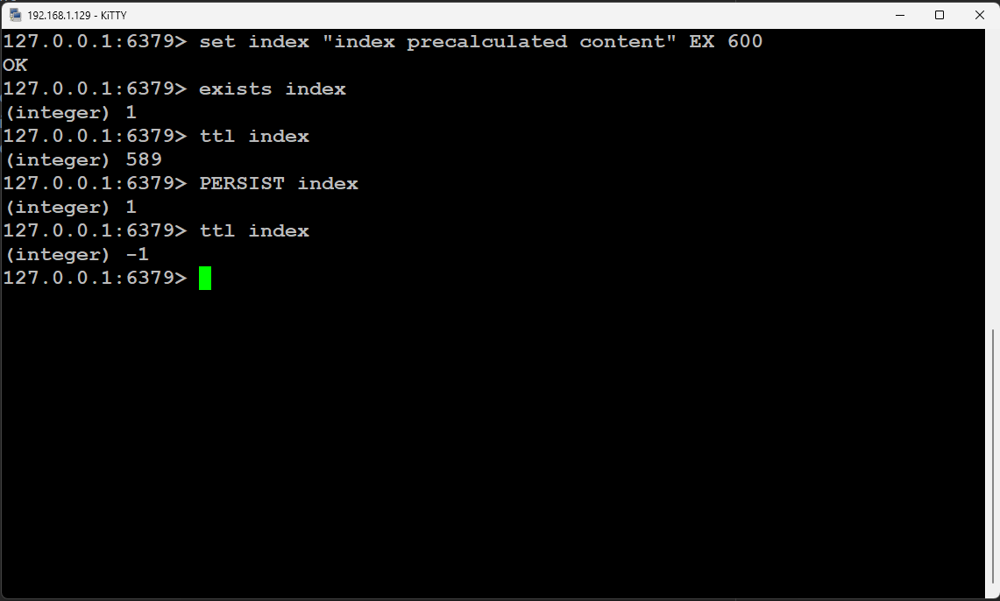

# Задание 1

Цель практической работы:
Научиться выполнять простые запросы в Redis.

## Что нужно сделать
Напишите последовательность команд для Redis:
* Создайте ключ index со значением “index precalculated content”.
* Проверьте, есть ли ключ index в БД.
* Узнайте, сколько ещё времени будет существовать ключ index.
* Отмените запланированное удаление ключа index.

* SET index "index precalculated content" EX 600
* EXISTS index
* TTL index
* PERSIST index

- SET используется для создания ключа со значением
- EXISTS проверяет существует ли данный ключ в бд
- TTL (Time To Live) проверяет оставшиеся время жизни ключа. В случае -1 бесконечно.
- PERSIST отменят время жизни ключа и устанавливает его в бесконечно. Значение -1