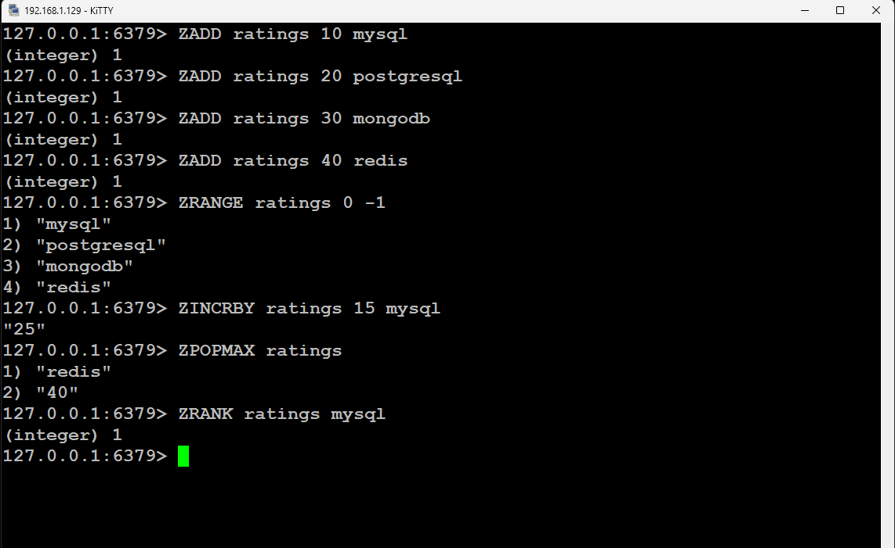

# Задание 2

Цель практической работы:
Научиться работать со структурами данных в Redis.

## Что нужно сделать

Напишите последовательность команд для Redis:

* Создайте в Redis структуру данных с ключом ratings для хранения следующих значений рейтингов технологий: 
mysql — 10, postgresql — 20, mongodb — 30, redis — 40.
* По этому же ключу увеличьте значение рейтинга mysql на 15.
* Удалите из структуры элемент с максимальным значением.
* Выведите место в рейтинге для mysql.

## Команды

* ZADD ratings 10 mysql
* ZADD ratings 20 postgresql
* ZADD ratings 30 mongodb
* ZADD ratings 40 redis
* ZRANGE ratings 0 -1
* ZINCRBY ratings 15 mysql
* ZPOPMAX ratings
* ZRANK ratings mysql

Для решиния данной задачи лучше использовать упорядоченное множество

* ZADD используется для добавления одного или нескольких элементов с их рейтингами в упорядоченное множество (sorted set)
* ZRANGE используется для получения элементов и их рейтингов из упорядоченного множества (sorted set) в 
заданном диапазоне позиций. В данном случае от 0 и до конца -1
* ZINCRBY используется для увеличения рейтинга элемента в упорядоченном множестве (sorted set)
* ZPOPMAX используется для извлечения элемента с максимальным рейтингом из упорядоченного множества (sorted set) и
его удаления из него
* ZRANK используется для получения позиции элемента в упорядоченном множестве (sorted set) по его значению.