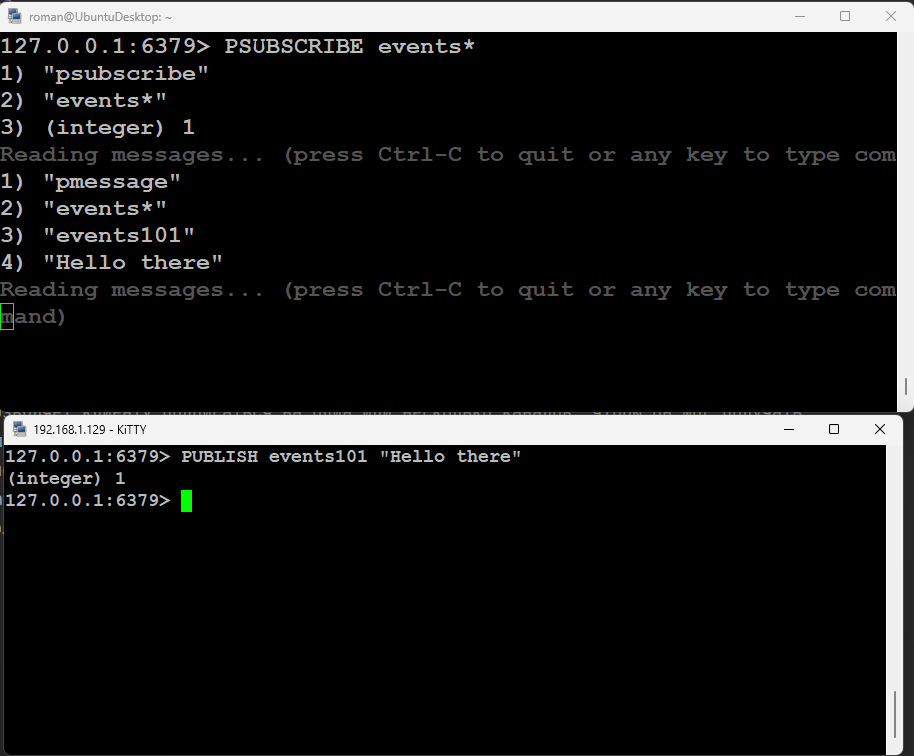

# Задание 3

Цель практической работы:
Научиться работать с механизмом Pub/Sub в Redis.

## Что нужно сделать

Напишите две команды для СУБД Redis:

* Подпишитесь на все события, опубликованные на каналах, начинающихся с events.
* Опубликуйте сообщение на канале events101 с текстом “Hello there”.

* PSUBSCRIBE events*
* PUBLISH events101 "Hello there"

* SUBSCRIBE позволяет клиенту подписаться на один или несколько каналов, чтобы он мог получать сообщения, опубликованные
  в этих каналах другими клиентами.
* PSUBSCRIBE используется для подписки на каналы с использованием шаблонов. events* означает любые каналы начинающиеся с events
* PUBLISH используется для публикации сообщения в определенный канал.
* PUBSUB CHANNELS используется для получения списка активных каналов. 